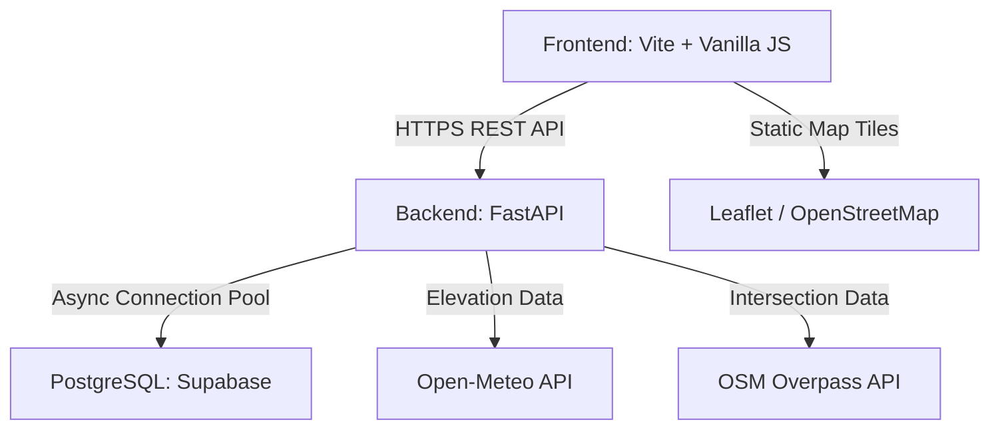
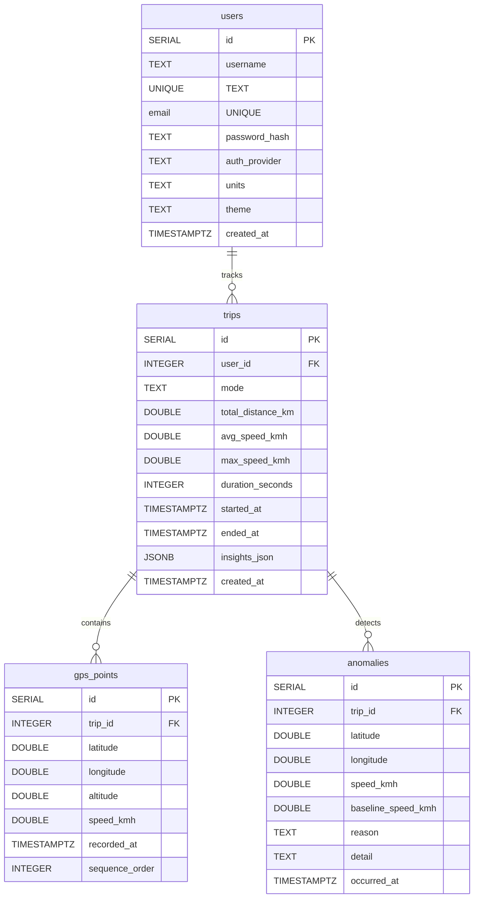

# JustGo — System Documentation & Technical Reference

Welcome to the official developer documentation for the **JustGo** Smart GPS Trip Tracker website. This document provides a detailed overview of the application architecture, database schemas, API specs, analysis algorithms, and development workflows.

---

## 🏛️ System Architecture

JustGo is built as a modular decoupled SPA (Single Page Application) with a high-performance Python FastAPI backend and a PostgreSQL (Supabase) data layer.



---

## 📂 Directory Structure

```text
JustGo-Smart-Trip-Planner/
│
├── backend/                  # FastAPI Application
│   ├── main.py               # Server Entry Point & Lifecycle Hooks
│   ├── database.py           # PostgreSQL asyncpg Pool Management
│   ├── models.py             # Pydantic schemas (validation)
│   ├── analysis.py           # Speed Engine & Insights Calculator
│   ├── routers/              # API Endpoints
│   │   ├── auth.py           # Register, Login, JWT session, Google OAuth
│   │   ├── trips.py          # Create, List, Detail, and Delete Trips
│   │   └── users.py          # Update Preferences & Theme
│   ├── render.yaml           # Deployment config (Blueprint)
│   └── requirements.txt      # Python package dependencies
│
└── frontend/                 # Vite SPA Frontend
    ├── index.html            # Main markup and script registration
    ├── vercel.json           # SPA Routing rules (Vercel)
    ├── package.json          # Vite Dev dependency list
    ├── styles/               # Styling layout
    │   ├── main.css          # Design system, themes & typography
    │   └── components.css    # Cards, buttons, modales & loading state animations
    └── js/                   # Logical layer
        ├── app.js            # Router, Auth Modal & global Toast System
        ├── background.js     # Three.js 3D Interactive Globe
        ├── services/
        │   ├── api.js        # Progressive retry HTTP fetch client
        │   ├── storage.js    # LocalStorage cache (offline support)
        │   └── geo.js        # Geolocation tracker & Haversine metrics
        └── pages/
            ├── home.js       # Global 3D dashboard & Tracking Panel
            ├── tracking.js   # Live Leaflet mapping & route tracking
            ├── summary.js    # Speed analysis, elevation plots & insights
            ├── history.js    # Trip history & thumbnails
            └── profile.js    # User settings and stats dashboard
```

---

## 🗄️ Database Schema Reference

JustGo is backed by **PostgreSQL (Supabase)**. Table creation and indices are handled automatically by `backend/database.py` during backend startup.



---

## 🔌 API Endpoints Reference

### 🔐 Authentication Router (`/api/auth`)

*   `POST /api/auth/register` — Registers a local username/password account. Returns access JWT token.
*   `POST /api/auth/login` — Sign in with email and password. Returns access JWT token.
*   `POST /api/auth/google` — Sign in or automatically register via Google ID credential. Returns access JWT token.
*   `GET /api/auth/me` — Fetch currently authenticated user account data using JWT.

### 🗺️ Trips Router (`/api/trips`)

*   `POST /api/trips` — Submit a completed trip. Expects mode, started/ended times, and complete array of GPS coordinates. Triggers automated Speed & Insight analysis.
*   `GET /api/trips` — Fetch list of all historical trips saved by the user (newest first).
*   `GET /api/trips/{trip_id}` — Get full trip records (Trip stats, array of GPS points, and detected anomalies).
*   `DELETE /api/trips/{trip_id}` — Deletes specified trip and automatically cascades deletions to all associated GPS points/anomalies in the DB.

### 👤 Users Router (`/api/users`)

*   `PUT /api/users/settings` — Update preferences such as tracking units (`km` vs `mi`) or UI theme mode (`light` vs `dark`).

---

## 📈 Tracking & Analysis Engine

### 1. Real-time Frontend Geolocation (`frontend/js/services/geo.js`)
*   Uses `navigator.geolocation.watchPosition` with high accuracy settings.
*   Calculates distance between coordinates using the **Haversine formula**:
    $$d = 2r \arcsin \left( \sqrt{ \sin^2 \left( \frac{\Delta \phi}{2} \right) + \cos(\phi_1) \cos(\phi_2) \sin^2 \left( \frac{\Delta \lambda}{2} \right) } \right)$$
*   Speeds are calculated between subsequent intervals. Points are color-coded in real-time as **Fast** (Green), **Average** (Yellow), or **Slow** (Red) based on standard pace parameters for the selected mode (`walk`, `run`, `drive`).

### 2. Backend Insight Analysis (`backend/analysis.py`)
When a trip is completed, the coordinates are uploaded to the backend. The analysis engine calculates secondary factors asynchronously:
*   **Elevation Profiler:** Queries Open-Meteo API to fetch elevations for GPS points to calculate climbing effort.
*   **Anomaly detection:** Flags instances where a user slows down to less than 40% of their baseline velocity.
*   **Contextual Overpass Queries:** Runs spatial bounding box queries to the OpenStreetMap Overpass API to detect if the slowdown took place near a:
    *   Traffic light (`highway=traffic_signals`)
    *   Intersection / Crossing (`highway=crossing` or `junction`)
    *   Steep incline (calculated using delta elevation)

---

## 🚀 Resilient Connection Pool Configuration

JustGo's backend leverages a persistent, highly-optimized connection pool configured in `backend/database.py` with custom rules tailored for cloud platforms (like Render free tier nodes connecting to Supabase):

*   **IPv4 Compatibility:** By utilizing Supabase's **Session Connection Pooler** on port `5432` (`aws-1-ap-south-1.pooler.supabase.com:5432`), the backend is fully capable of connecting from IPv4-only hosting environments (Render free tier), overcoming the limitations of Supabase's direct IPv6-only database domains.
*   **Lifespan Management:** Pool is created during application startup lifespan and closed gracefully on shutdown to prevent connection leaks.
*   **Startup Resilience:** Features progressive retry connection back-off logic during startup. If Supabase is sleeping or waking up, the API will not crash; it will pre-warm in the background and become available automatically as soon as the DB wakes up.
